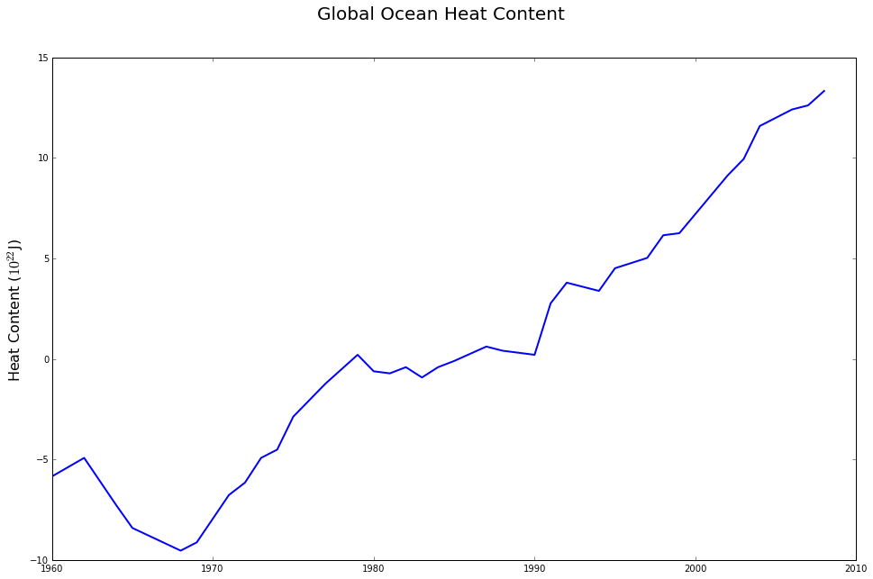
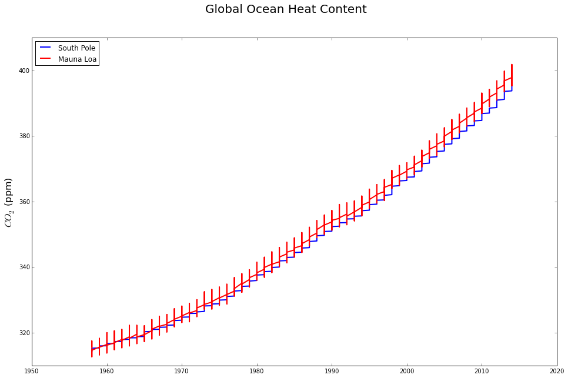

# Introduction

This notebook shows a simple example on how to start using IPython Notebooks.

We start from basic stuff, namely, loading your data, working with arrays and so
on.

Then, we show you how to make your notebook a bit more interactive by giving the
user the freedom to play with some parameters.

Finally, we show you how you can publish your notebook on Github so that it can
be shared with, for instance, your colleagues or your students.

## About the example

To make the notebook more coherent, we have selected a simple example that uses
real data about a very serious issue of our time: **global warming**.

We assume that you have recently published a paper on how *the amount of CO2*
released into the atmoshpehere is correlated with *oceans' global heat content*.
We assume that you have analyzed the data, published it in a paper
[here](paper_link) and at this point would like to share the code with your
colleagues.

Let's get started then!

# Loading the Data

We first start by loading the data. We assume that the data is stored in a file
called `CO2Data.csv` in the `/Data/` folder.

Here's a snapshot of the CSV file.

In short, our csv file has has *14* "columns" that contain the data we are
interested in. These columns that we are interested in correspond to

1. Mauna Loa: the amount of CO2 measured at the first location (in ppm)
2. CO2 Dates: the dates when CO2 amount was measured in ppm
3. South Pole: the amount of CO2 measured at the second location (in ppm)
4. Heat content: oceans' heat content (in 10^22 J)
5. Heat Content Dates: the dates where amount of heat content is measured
6. +2 Standard Error: standard deviation for the heat content
7. -2 Standard Error: standard deviation for the heat content
8. Temperature Anomaly: the deviation in the temperature
9. Temperature Dates: the dates where heat content was measured

Source: <a href="http://scrippsco2.ucsd.edu/">Scripps CO2</a> <a
href="http://www.carbonbrief.org/blog/2013/09/ipcc-six-graphs-that-explain-how-
the-climate-is-changing/">The Carbon Brief</a> & <a
href="http://www.economist.com/blogs/graphicdetail/2012/05/daily-chart-1">The
Economist</a>

### Initialization

We start by importing the necessary libraries and initializing our data
variables

    import csv                                    # Import the necessary library to work with csv files                              

Now the command below creates an *empty* dcitionaries whose *keys* match those
of our csv file.

This will become handy since we want to organize our data into columns later.

    data_entries = {'Heat Content':[],
                    'Mauna Loa':[],
                    'CO2 Dates':[],
                    'South Pole':[],
                    'Heat Content Dates':[],
                    '+2 Standard Error':[],
                    '-2 Standard Error':[],
                    'Temperature Anomaly':[],
                    'Temperature Dates':[],
                    'trace6':[],
                    'trace7':[],
                    'trace8':[],
                    'trace9':[],
                    'trace10':[]}

### Reading the Data

We now load the columns' data from the csv file into the *data_entries*
variable.

    data_file_name = './Data/CO2Data.csv'
    with open(data_file_name, 'rb') as f:
        reader = csv.DictReader (f)
        for line in reader:
            for item in line:
                if 'Dates' not in item:
                    if line[item]:
                        data_entries[item].append(float(line[item]))
                else:
                    if line[item]:
                        data_entries[item].append(line[item])
                        #data_entries[item].append(int(line[item][0:4]))

To make sure that we have importted the data correctly, let's print the first 8
dates when the CO2 amount was measured.

    print data_entries['CO2 Dates'][0:8]

    ['1958-03-01', '1958-04-01', '1958-05-01', '1958-06-01', '1958-07-01', '1958-08-01', '1958-09-01', '1958-10-01']

# Basic Plots

Let's start with our first plot, namely, *global ocean heat content* as a matter
of time.

We start by import *matplotlib*, a Python library that handles plots elegantly.

    import matplotlib.pyplot as plt                # Import the necessary library to plot results

We then make sure that plots are displayed within the cells and adjust their
size.

    %matplotlib inline  
    plt.rcParams['figure.figsize'] = (16.0, 10.0)

It is time to plot our first result. We first re-organize our x-axis dates to
only contain the years.

    years = []
    for item in data_entries['Heat Content Dates']:
        years.append(int(item[0:4]))

Then, prepare the axis labels and plot title before plotting the results.

    fig = plt.figure()
    fig.suptitle('Global Ocean Heat Content', fontsize=20)
    #plt.xlabel('Year', fontsize=18)
    plt.ylabel('Heat Content ($10^{22}$J)', fontsize=16)
    
    plt.plot(years,data_entries['Heat Content'],linewidth=2)
    plt.show()

Finally, save the figure if you want.

    fig.savefig('./Results/HeatContent_vs_Year.png')

### The Second Plot

Now let us plot the amount of CO2 in the atmosphere in the course of the years.

Note that we now have to pieces of data, one corresponding to *South Pole* and
the other capturing CO2 in *Mauna Loa*.

    co2_years = []
    for item in data_entries['CO2 Dates']:
        co2_years.append(int(item[0:4]))

    fig = plt.figure()
    fig.suptitle('Global Ocean Heat Content', fontsize=20)
    #plt.xlabel('Year', fontsize=18)
    plt.ylabel('$CO_2$ (ppm)', fontsize=16)
    
    plt.plot(co2_years,data_entries['South Pole'],linewidth=2,label='South Pole')
    plt.plot(co2_years,data_entries['Mauna Loa'],linewidth=2,color='r',label='Mauna Loa')
    plt.legend(loc='upper left')
    plt.show()

Again, you can save the figure if you want.

    fig.savefig('./Results/CO2_vs_Year.png')

    
